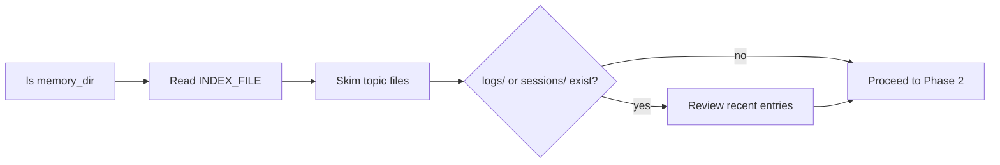

# Dream: Memory Consolidation Skill

> Invoke: `/dream` (project) | `/dream user` (user-level) | `/dream all` (both)

Reflective pass over Claude Code's auto-memory files. Synthesizes recent learnings into durable, well-organized memories so future sessions orient fast.

---

## Scope Resolution

```yaml
project:
  memory_dir: .claude/memories/
  index_file: .claude/memories/MEMORY.md
  transcripts_dir: .claude/transcripts/
  index_max_lines: 150

user:
  memory_dir: ~/.claude/memories/
  index_file: ~/.claude/memories/MEMORY.md
  transcripts_dir: ~/.claude/transcripts/
  index_max_lines: 200
```

**Flag behavior:**
- `/dream` → project scope only (default)
- `/dream user` → user scope only
- `/dream all` → project first, then user

---

## Phase 1 — Orient



1. `ls` the memory directory to see what exists
2. Read `${INDEX_FILE}` — understand current index
3. Skim existing topic files to avoid creating duplicates
4. If `logs/` or `sessions/` subdirs exist, review recent entries

---

## Phase 2 — Gather Recent Signal

Priority order:

1. **Daily logs** (`logs/YYYY/MM/YYYY-MM-DD.md`) if present
2. **Drifted memories** — facts that contradict current codebase/state
3. **Transcript search** — narrow grep ONLY, never read whole files:

```bash
grep -rn "<narrow_term>" ${TRANSCRIPTS_DIR}/ --include="*.jsonl" | tail -50
```

### NEVER-LIE Rule (inherited)
- Only consolidate VERIFIED facts
- If uncertain, grep transcripts to confirm before writing
- Wrong memory = worse than no memory

---

## Phase 3 — Consolidate

For each thing worth remembering, write or update a memory file at the top level of the memory directory. Follow auto-memory conventions from system prompt.

### Focus:
- **Merge** new signal into existing topic files (no near-duplicates)
- **Absolute dates** — convert "yesterday", "last week", "next Friday" → `2026-03-25`
- **Delete contradictions** — if today's investigation disproves old memory, fix at source
- **Context compression** — Mermaid for flows, YAML for state, prose for NOTHING

### Classification for merge decisions:

```yaml
actions:
  duplicate: merge into existing file, delete duplicate
  contradiction: keep newer fact, delete older, log change
  stale: delete if >30 days with no transcript reference
  relative_date: convert to absolute ISO date
  verbose: compress to YAML/Mermaid, remove prose
  code_convention: belongs in CLAUDE.md or .claude/rules/, NOT memory
  sensitive: never store tokens/keys/passwords in memory
```

---

## Phase 4 — Prune & Index

Update `${INDEX_FILE}` to stay under `${INDEX_MAX_LINES}` lines.

### Rules:
- Index = **pointers** with one-line descriptions, NOT content dumps
- Remove pointers to stale/wrong/superseded memories
- Demote verbose entries: gist in index, detail in topic file
- Add pointers to newly important memories
- Resolve contradictions — if two files disagree, fix the wrong one

---

## Output

Return a structured summary:

```yaml
dream_summary:
  scope: project|user|all
  date: YYYY-MM-DD
  consolidated: [list of merged files]
  updated: [list of modified files]
  pruned: [list of deleted/removed files]
  unchanged: [list of files kept as-is]
  issues_found:
    duplicates: N
    contradictions: N
    stale: N
    relative_dates: N
    verbose: N
  index_lines_before: N
  index_lines_after: N
```

If nothing changed (memories already tight), say so.

---

## Integration Notes

- Runs AFTER session work, BEFORE `/compact` or session kill
- Complements 50% context rule: dream keeps memory lean between sessions
- Does NOT touch CLAUDE.md or .claude/rules/ (Layer 1-3) — memory only
- Safe to run nightly via AUTOLOOP if desired
