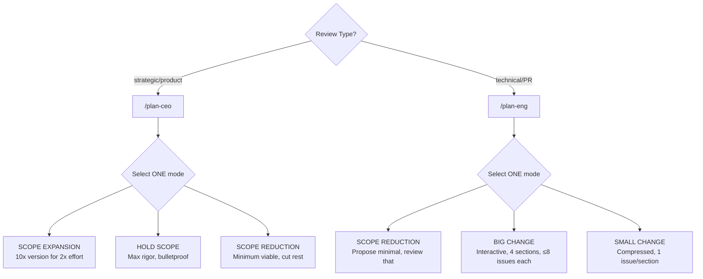
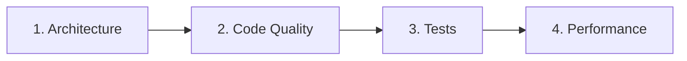
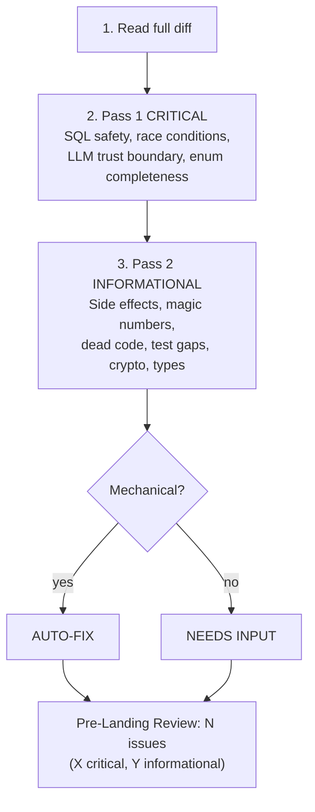

# CLAUDE.md — BidDeed.AI / Everest Capital USA

## Identity
```yaml
founder: Ariel Shapira
company: BidDeed.AI / Everest Capital USA
experience: 10+ yr foreclosure investing, Brevard County FL
licenses: FL broker, general contractor
style: direct, no softening, facts+actions
adhd: systems must self-run
```

## Stack
```yaml
repos: github.com/breverdbidder/*
  active: [cli-anything-biddeed, zonewise-scraper-v4, biddeed-ai, biddeed-ai-ui, zonewise-web, cliproxy-gateway, tax-insurance-optimizer]
db: Supabase mocerqjnksmhcjzxrewo.supabase.co
  tables: [multi_county_auctions(245K), activities, insights, daily_metrics]
compute: Hetzner 87.99.129.125 (CLIProxyAPI 127.0.0.1:8317)
ai:
  free: Gemini Flash (CLIProxyAPI) — DEAD, keys expired
  cheap: DeepSeek V3.2 ($0.28/1M)
  primary: Claude (Max plan, never API)
deploy: [GitHub Actions, Cloudflare Pages, Render]
brand: { primary: "#1E3A5F", accent: "#F59E0B", font: Inter, bg: "#020617" }
```

## Context Rules
```yaml
triggers:
  auction_or_property: query Supabase multi_county_auctions first
  case_number: search multi_county_auctions.case_number
  deal_analysis: apply (ARV×70%)-Repairs-$10K-MIN($25K,15%×ARV)
  pipeline_health: check daily_metrics + recent GHA runs
  county_mention: verify counties/ config exists before assuming
  build_request: follow cli-anything HARNESS.md 7-phase
  deploy: push to GitHub, never local/GDrive
  spend_over_10: STOP and confirm
  context_switch: flag "📌 [previous task] still open"
  summit: execute immediately, zero questions
```

## Work Principles
```yaml
rules:
  - execute first, report results
  - $10/session max, batch ops, one attempt per approach
  - zero HITL: 3 alternatives before surfacing blocker
  - push back with strong opinions when disagreeing
  - wrong = "I was wrong", never invent numbers
```

## Slash Commands
```yaml
commands:
  /auction-brief: morning auction briefing from Supabase
  /county-setup: onboard new FL county
  /deal-intel: process foreclosure docs → structured data
  /tldr: end-of-session summary, update memory.md
  /transcript: YouTube video analysis via Hetzner pipeline
```

## Family
```yaml
wife: Mariam (Property360 real estate, Protection Partners insurance, contracting)
son: Michael (16, D1 swimmer, Satellite Beach HS, keto diet, Shabbat)
observance: Orthodox (Shabbat Fri sunset–Sat havdalah, kosher, holidays)
```

## Session Hygiene (Mar 15, 2026)

### Mandatory Plugins
```yaml
plugins:
  context7: { purpose: live API docs, install: "/plugin → context7", cost: $0 }
  cc-status-line: { purpose: context monitor, install: "npx cc-status-line@latest" }
  cctop: { purpose: sessions dashboard, install: "curl -fsSL https://raw.githubusercontent.com/DeanLa/cctop/main/install.sh | bash", fork: breverdbidder/cctop }
```

### Context Window Rules
```yaml
rules:
  50pct_rule: kill+restart at ~50% context
  never_compact: loses working context, keeps stale — always fresh start
  sub_agents: dispatch via Superpowers for heavy work
  harness_checkpoint: save state + restart if >50% mid-pipeline
cc_status_line:
  line1: "model | context% | session_cost | session_clock"
  line2: "git_branch | git_worktree"
```

---

# GSTACK PATTERNS
```yaml
source: garrytan/gstack (MIT)
deployed: Mar 17, 2026
fork: breverdbidder/gstack
```

## AskUserQuestion Format (MANDATORY)
```yaml
format:
  1_reground: project + branch + current task (1-2 sentences)
  2_eli16: plain English a 16yo follows, no jargon, concrete examples
  3_recommend: "RECOMMENDATION: Choose [X] because [reason]"
  4_options: "A) ... B) ... C) ..."
assumption: user hasn't looked in 20 min, no code open
```

## Review Modes



### CEO Mode Directives
```yaml
directives:
  - zero silent failures — every failure mode visible
  - every error has a name — specific exception, not "handle errors"
  - data flows have shadow paths — nil, empty, upstream error
  - diagrams mandatory — Mermaid for every new data flow
  - deferred = written in TODOS.md or doesn't exist
  - optimize for 6-month future
  - permission to say "scrap it and do this instead"
critical: once mode selected, NEVER drift to another
```

### Eng Mode Sections

```yaml
eng_sections:
  architecture: [system design, dependencies, coupling, scaling, security, failure scenarios]
  code_quality: [DRY, error handling, edge cases, tech debt, over/under-engineering]
  tests: [diagram UX/data/code flows, verify test exists, check eval.json]
  performance: [N+1 queries, unbounded selects, missing indexes, recomputation]
rule: STOP after each section, present issues one-at-a-time, resolve before next
```

## Fix-First Review (MANDATORY)


## visual-explainer Skill
```yaml
source: ~/.claude/skills/visual-explainer/plugins/visual-explainer/SKILL.md
output: ~/.agent/diagrams/ (open in browser)
commands: [/diff-review, /plan-review, /project-recap, /generate-web-diagram, /generate-slides, /fact-check]
brand: templates/biddeed-brand-preset.html
auto_trigger: "table 4+ rows OR 3+ columns → HTML, never ASCII"
```
