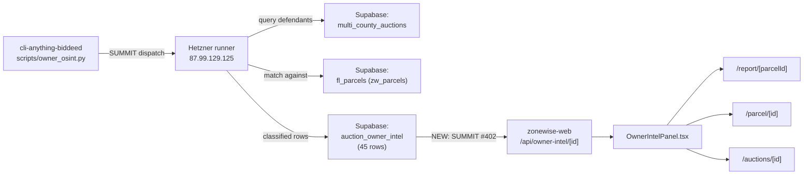
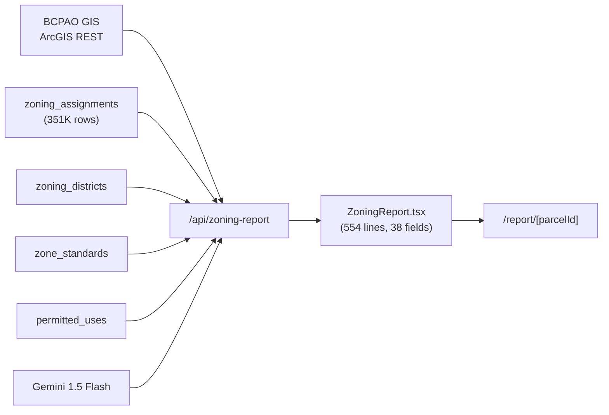
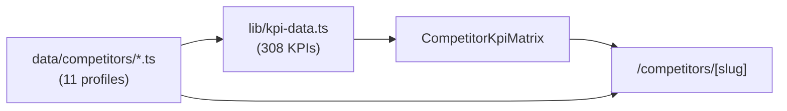
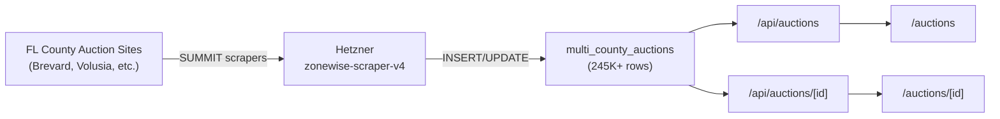

# ZoneWise.AI — Architecture Map

> Generated by SUMMIT #402 (2026-04-09). Honesty Protocol in force: every claim is VERIFIED (proof cited), INFERRED (evidence given), or UNTESTED (zero penalty).

## 1.1 Overview

ZoneWise.AI is a Next.js 15 application providing AI-powered zoning intelligence, foreclosure auction analysis, and parcel-level property data for Florida real estate investors. It consumes data from Supabase (primary), BCPAO GIS (Brevard County), Gemini AI, and the OSINT classification pipeline in `cli-anything-biddeed/scripts/owner_osint.py`.

Source: SUMMIT issue #402 in `breverdbidder/cli-anything-biddeed`.

## 1.2 Repository Structure

```
app/              — 36 page routes + 28 API routes (83 files total)
components/       — UI components grouped by feature (238 files)
lib/              — Business logic, Supabase clients, validation, KPI data (39 files)
data/             — Static data files: competitor profiles (2 files)
types/            — TypeScript interfaces (4 files)
docs/             — Architecture, plans, reports (40 files)
supabase/         — Migrations + RLS policies (11 files)
scripts/          — Utility scripts (10 files)
tests/            — Test suites (22 files)
__tests__/        — Component/API tests (12 files)
public/           — Static assets (6 files)
.claude/          — Skills, rules, commands (53 files)
.github/          — CI/CD workflows (41 files)
migrations/       — Legacy migration SQL (7 files)
```

## 1.3 Page Route Map

VERIFIED via `git ls-files 'app/**/page.tsx'` (36 pages):

```
/                                          (marketing homepage)
├── /competitors                           (battle cards index)
│   └── /competitors/[slug]                (11 competitor battle cards)
├── /pricing                               (subscription plans)
├── /kpis                                  (308 KPI catalog browser)
├── /demo                                  (interactive demo)
├── /docs                                  (documentation)
├── /help                                  (help center)
├── /disclaimer                            (legal disclaimer)
├── /privacy                               (privacy policy)
├── /terms                                 (terms of service)
├── /chat-v2                               (Dify-powered chat)
├── /conquest                              (county conquest dashboard)
│   └── /conquest/[county]                 (per-county conquest view)
├── /labs/3d-viewer                        (experimental 3D parcel viewer)
├── /foreclosures/[county]                 (county foreclosure pages)
├── /sign-in/[[...sign-in]]               (Clerk sign-in)
├── /sign-up/[[...sign-up]]               (Clerk sign-up)
├── /forgot-password                       (auth: forgot password)
├── /login                                 (auth: login)
├── /reset-password                        (auth: reset password)
├── /signup                                (auth: signup)
└── (dashboard)
    ├── /app                               (app landing)
    ├── /dashboard                         (main dashboard)
    ├── /explorer                          (Mapbox GL explorer)
    ├── /explore                           (explore landing)
    │   └── /explore/[parcelId]            (Development Intelligence + 3D envelope)
    ├── /parcel/[id]                       (BCPAO parcel detail)
    ├── /report                            (report landing)
    │   └── /report/[parcelId]             (38-field zoning report + Owner Intel)
    ├── /auctions                          (auction list)
    │   └── /auctions/[id]                 (auction detail + Owner Intel)
    ├── /chat                              (Claude-powered zoning chat)
    ├── /feasibility                       (development feasibility)
    └── /massing                           (building massing tool)
```

## 1.4 API Route Map

VERIFIED via `git ls-files 'app/api/**/route.ts'` — 29 API endpoints (28 original + 1 new from SUMMIT #402):

| # | Route | Method | Purpose | Reads | Writes | Auth |
|---|---|---|---|---|---|---|
| 1 | `/api/health` | GET | Health check: env vars + Supabase ping | env vars, Supabase REST | — | public |
| 2 | `/api/stats` | GET | DB health stats: county count, parcel estimate, zoning codes | multi_county_auctions, zoning_codes, zoning_assignments, fl_parcels_count_estimate RPC | — | public |
| 3 | `/api/kpis` | GET | Returns 63 KPIs from zonewise_kpis table | zonewise_kpis | — | public |
| 4 | `/api/auctions` | GET | List auctions with county/type/bbox filters, paginated | multi_county_auctions | — | public |
| 5 | `/api/auctions/[id]` | GET | Auction detail with zoning enrichment, BCPAO photos, Shapira formula | multi_county_auctions, fl_parcels, BCPAO GIS | — | public |
| 6 | `/api/auctions/summary` | GET | Auction stats: totals by county/type, vacant land, condos | multi_county_auctions | — | public |
| 7 | `/api/parcels/[parcelId]` | GET | Parcel detail + auction status + zoning + GeoJSON geometry | fl_parcels, multi_county_auctions, zoning_assignments, parcel_geojson RPC | — | public |
| 8 | `/api/parcels/featured` | GET | Featured Palm Bay foreclosure with zoning assignment | fl_parcels, multi_county_auctions, zoning_assignments | — | public |
| 9 | `/api/bcpao-lookup` | GET | Query BCPAO GIS by parcel ID or tax account | BCPAO ArcGIS REST | — | public |
| 10 | `/api/bcpao-photo` | GET | Proxy BCPAO property photos (domain-locked) | External BCPAO URLs | — | public |
| 11 | `/api/zoning-report` | GET | 38-field zoning report: lot info, standards, permitted uses, Gemini AI summary | zoning_assignments, zoning_districts, zone_standards, permitted_uses, BCPAO GIS, Gemini | — | public |
| 12 | `/api/zoning-report/pdf` | GET | Redirect to printable report page (?print=1) | — | — | public |
| 13 | `/api/zoning-chat` | POST | Stream Claude responses for zoning design analysis | zoning_assignments, zoning_districts, zone_standards, permitted_uses | chat logs | public |
| 14 | `/api/explorer/zoning-overlay` | GET | GeoJSON zoning polygons from BCPAO ArcGIS for Mapbox data-driven styling | BCPAO ArcGIS Feature Service | — | public |
| 15 | `/api/explorer/chat` | POST | Stream Haiku-based explorer AI with MAP action commands | Anthropic API | — | public |
| 16 | `/api/explorer/propzone-intel` | GET | PropZone competitor zoning data for parcel | propzone_intel | — | public |
| 17 | `/api/explorer/zillow` | GET | ZHVI/ZORI metrics merged with Census ZCTA boundaries for Brevard | Zillow CSV, Census ArcGIS REST | — | public |
| 18 | `/api/owner-intel/[identifier]` | GET | **NEW (SUMMIT #402)** OSINT classification from auction_owner_intel | auction_owner_intel, multi_county_auctions | — | public |
| 19 | `/api/chat` | POST | Claude AI zoning chat with Clerk auth + query limits | subscriptions, multi_county_auctions, zoning_assignments, Anthropic | subscriptions (queries_used), chat_history | protected (Clerk) |
| 20 | `/api/chat-v2` | POST | Proxy to Dify Service API on Hetzner | Dify API (87.99.129.125:3100) | — | public |
| 21 | `/api/chat-feedback` | POST | Log zoning chat feedback | — | chat_feedback | public |
| 22 | `/api/beta-signup` | POST | Beta waitlist email registration | — | beta_signups | public |
| 23 | `/api/reports/generate` | POST | 63-KPI development analysis report | parcel_zones, zoning_districts, dimensional_standards, BCPAO | — | public |
| 24 | `/api/stripe/checkout` | POST | Create Stripe checkout session | subscriptions | subscriptions (via webhook) | protected (Clerk) |
| 25 | `/api/stripe/webhook` | POST | Handle Stripe events (checkout, subscription deleted) | Stripe webhook | subscriptions | public (sig verify) |
| 26 | `/api/admin/enrich-zoning` | POST | Batch enrich auctions with zoning from fl_parcels | multi_county_auctions, fl_parcels | multi_county_auctions | protected (ENRICH_SECRET) |
| 27 | `/api/admin/llm-status` | GET | Circuit breaker status for LLM providers | in-memory state | — | protected (x-admin-key) |
| 28 | `/api/migrations/onboarding` | POST/GET | Run/check onboarding_events migration | — | onboarding_events (DDL) | protected (ADMIN_SECRET) |
| 29 | `/api/debug-deploy` | GET | Deployment version marker + directional prefix test | — | — | public |

## 1.5 Data Layer (Supabase Tables)

Tables touched by zonewise-web API routes (INFERRED from code reads — row counts require Supabase query):

| Table | Purpose | Key Columns | Consumer Routes |
|---|---|---|---|
| `multi_county_auctions` | Foreclosure auctions (245K+ rows) | id, parcel_id, case_number, county, sale_date, opening_bid, status | `/api/auctions/*`, `/api/parcels/*`, `/api/owner-intel/*` |
| `fl_parcels` | FL statewide parcels | pin, co_no, site_addr, val_market, owner_name, dor_use_code | `/api/auctions/[id]`, `/api/parcels/*`, `/api/admin/enrich-zoning` |
| `zoning_assignments` | Zone assignments (351K+ rows) | parcel_id, zone_code, jurisdiction | `/api/zoning-report`, `/api/explorer/zoning-overlay`, `/api/parcels/*` |
| `zoning_districts` | Zone district definitions | zoning_district_id, district_name | `/api/zoning-report`, `/api/zoning-chat` |
| `zone_standards` | Dimensional standards per district | zoning_district_id, max_far, setbacks, water_setback_ft | `/api/zoning-report`, `/api/zoning-chat` |
| `permitted_uses` | Permitted uses per zone | zoning_district_id, use_category | `/api/zoning-report`, `/api/zoning-chat` |
| `zoning_codes` | Zone rule definitions (7,531 rows) | zoning_code, county | `/api/stats` |
| `auction_owner_intel` | **OSINT classification (45 rows, VERIFIED Apr 9)** | case_number, defendant, classification, match_count, total_portfolio_value, parcels_owned, confidence_score | `/api/owner-intel/[identifier]` |
| `propzone_intel` | PropZone competitor data | parcel_id, setbacks, far, parking | `/api/explorer/propzone-intel` |
| `zonewise_kpis` | KPI metadata (63 rows) | kpi_code, category, source | `/api/kpis` |
| `subscriptions` | Stripe subscriptions | user_id, status, stripe_customer_id | `/api/chat`, `/api/stripe/*` |
| `chat_history` | Chat conversation logs | session_id, query, response | `/api/chat` |
| `chat_feedback` | Chat feedback ratings | session_id, rating, feedback_text | `/api/chat-feedback` |
| `beta_signups` | Waitlist signups | email | `/api/beta-signup` |
| `onboarding_events` | User onboarding tracking | event_type, user_id | `/api/migrations/onboarding` |

## 1.6 Data Flow Diagrams

### Diagram A: OSINT Pipeline (cli-anything-biddeed to zonewise-web)



### Diagram B: Zoning Report Data Flow



### Diagram C: Competitor Battle Card Data Flow



### Diagram D: Auction Pipeline



## 1.7 External Integrations

| Service | Purpose | Auth Method |
|---|---|---|
| Mapbox GL 3.0 | Vector tile maps in Explorer | `NEXT_PUBLIC_MAPBOX_TOKEN` |
| BCPAO GIS | Brevard parcel records + zoning polygons | Public ArcGIS REST (no key) |
| Gemini 1.5 Flash | AI zoning summaries in reports | `GEMINI_API_KEY` |
| Anthropic Claude | Zoning chat + explorer chat | `ANTHROPIC_API_KEY` |
| Clerk | User authentication (conditional) | `CLERK_SECRET_KEY` |
| Stripe | Subscription payments | `STRIPE_SECRET_KEY` + webhook signing |
| Supabase | Primary data layer | `SUPABASE_SERVICE_ROLE_KEY` / `NEXT_PUBLIC_SUPABASE_ANON_KEY` |
| Dify | Chat v2 on Hetzner (port 3100) | `DIFY_SERVICE_API_KEY` |
| Zillow | ZHVI/ZORI housing metrics | Public CSV download |
| US Census | ZCTA boundary polygons | Public ArcGIS REST |

## 1.8 The 5 Sibling Repos

**`zonewise-web`** (this repo) — The Next.js 15 frontend application serving zonewise.ai. Contains all page routes, API routes, components, and the KPI catalog. Deployed via Vercel with Cloudflare DNS.

**`cli-anything-biddeed`** — The agent harness and SUMMIT dispatcher. Contains OSINT scripts (`owner_osint.py`), scraper configurations, pipeline orchestration, and the EG14 enterprise-grade verification suite. Runs on Hetzner via GitHub Actions.

**`zonewise-scraper-v4`** — County auction scrapers. Collects foreclosure and tax deed auction data from Florida county websites and writes to `multi_county_auctions` in Supabase.

**`biddeed-ai` / `biddeed-ai-ui`** — The BidDeed.AI investor-facing auction intelligence platform. Shares the Supabase database with zonewise-web but serves a different audience (auction bidders vs. zoning analysts).

**`cliproxy-gateway`** — CLIProxyAPI gateway on Hetzner (127.0.0.1:8317). Routes LLM requests to Gemini Flash (free) and DeepSeek V3.2 ($0.28/1M) to minimize AI costs.

## 1.9 Known Gaps

| Gap | Status | Notes |
|---|---|---|
| `auction_owner_intel` (45 rows) | **WIRED (SUMMIT #402)** | Now served via `/api/owner-intel/[identifier]` and displayed in OwnerIntelPanel on report/parcel/auction pages |
| `/report/[parcelId]` 500 | **FIXED (SUMMIT #402)** | Was using non-Promise params type (Next.js 15 breaking change). Fixed to `params: Promise<{ parcelId: string }>` |
| `/parcel/[id]` | Working | Already used correct Promise params pattern |
| `/explorer` | UNTESTED in production | Page structure is sound (ExplorerLoader with error boundary). 500 if any may be client-side Mapbox runtime issue, not server error |
| `zw_parcels.zoning_*` columns | Mostly NULL | Enrichment pipeline not complete for all Brevard rows |
| `zone_standards.water_setback_ft` | NULL for all Brevard rows | Column exists but awaiting data population |
| `zoning-overlay` serves GeoJSON (not MVT) | Feature, not gap | Returns GeoJSON FeatureCollection enriched with zone_category and zone_color from BCPAO ArcGIS. Used for Mapbox data-driven styling at zoom >= 13. PropZone gap `ZON-MAPBOX-TILES` is partially addressed — we serve zoning geometry but via GeoJSON not vector tiles |
| KPI table vs static catalog mismatch | Known | `zonewise_kpis` table has 63 rows; `lib/kpi-data.ts` has 308 static KPIs. The table predates the expanded catalog |

## 1.10 SUMMIT #402 Changes

This SUMMIT delivered:
1. `docs/ARCHITECTURE.md` — this file (full repo map)
2. Explorer zoning-overlay documented in section 1.9 (GeoJSON, not MVT)
3. `lib/kpi-data.ts` — +10 Ownership KPIs (298 -> 308), new Ownership category
4. `data/competitors/propzone.ts` — 40W -> 50W, OSINT advantages, verdict update
5. `app/api/owner-intel/[identifier]/route.ts` — new API reading auction_owner_intel
6. `components/parcel/OwnerIntelPanel.tsx` — classification badge + portfolio table
7. Wired into `/report/[parcelId]`, `/parcel/[id]`, `/auctions/[id]` + fixed report 500
