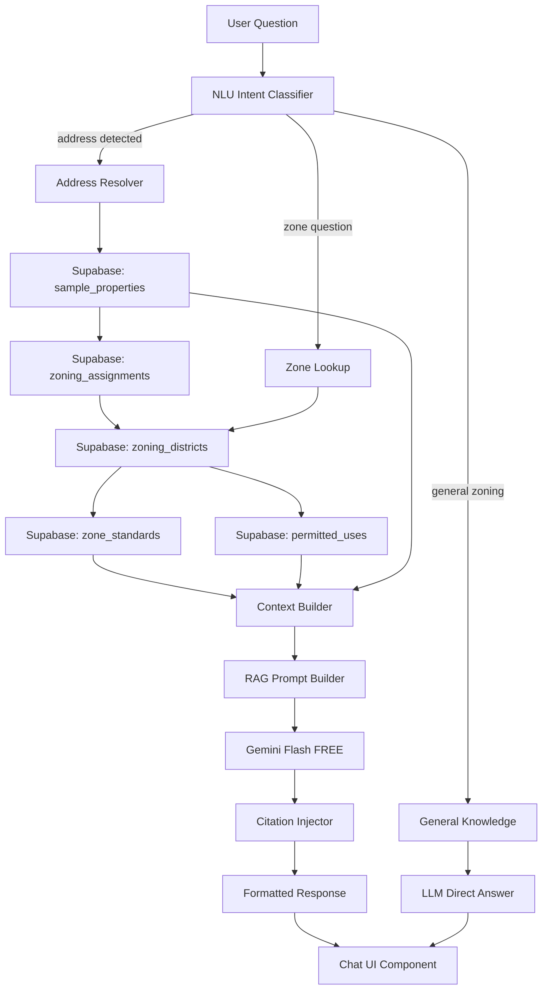

# AI-ZONING-CHATBOT-SPEC: ZoneWise AI Zoning Assistant
## Status: DISPATCH READY
## Priority: P0 (matches Algoma's #1 shipped feature)
## Author: Claude AI Architect
## Date: 2026-03-25

## Architecture



## Why Structured RAG > Vector RAG

Algoma likely embeds Zoneomics PDFs into vectors. We skip that entirely:
- Our data is STRUCTURED (SQL tables, not PDFs)
- Direct SQL queries are 100% accurate (no embedding drift)
- Citations point to exact table/row, not "chunk from PDF page 47"
- Zero vector DB cost
- Instant retrieval (SQL query < 50ms vs vector search ~200ms)

## Data Flow

```yaml
intent_types:
  address_lookup:
    trigger: "What can I build at 2680 Donna Dr?"
    pipeline: address → sample_properties → zoning_assignments → zoning_districts → zone_standards + permitted_uses
    citation: "Source: Brevard County zoning code {district.code}, {district.name}"
    
  zone_question:
    trigger: "What does R-1A allow?"
    pipeline: zone_code → zoning_districts → zone_standards + permitted_uses
    citation: "Source: {jurisdiction} Zoning Ordinance, District {code}"
    
  comparison:
    trigger: "What's the difference between R-1 and R-3?"
    pipeline: both zone_codes → side-by-side zone_standards
    citation: "Source: {jurisdiction} Zoning Districts comparison"
    
  capacity:
    trigger: "How many units can I build on a 0.5 acre R-3 lot?"
    pipeline: zone_standards → compute capacity → format
    citation: "Calculated from {district} standards: density {X} du/acre, FAR {Y}"
    
  permitted_use:
    trigger: "Can I build a daycare in C-2?"
    pipeline: permitted_uses WHERE district = C-2 AND use ILIKE daycare
    citation: "Source: {jurisdiction} permitted uses table"
    
  general:
    trigger: "What is FAR?"
    pipeline: LLM direct (no DB needed)
    citation: none (general knowledge)
```

## LLM Strategy

```yaml
primary: gemini-2.0-flash (FREE via Gemini API key)
fallback: deepseek-v3.2 ($0.28/1M tokens)
quality: claude-sonnet (for complex multi-step reasoning, Max plan)

routing:
  simple_lookup: gemini-flash (80% of queries)
  comparison: gemini-flash
  capacity_calc: gemini-flash + function calling
  complex_legal: claude-sonnet (rare, <5%)
```

## Prompt Template

```
SYSTEM: You are ZoneWise AI, a Florida zoning intelligence assistant.
You answer zoning questions using ONLY the data provided in the context below.
Always cite your sources using [Source: ...] format.
If the data doesn't contain the answer, say "I don't have that information in my database" - never guess.
Be concise. Use bullet points for lists. Include specific numbers (heights, setbacks, etc).

CONTEXT:
{structured_context_from_supabase}

USER: {question}
```
