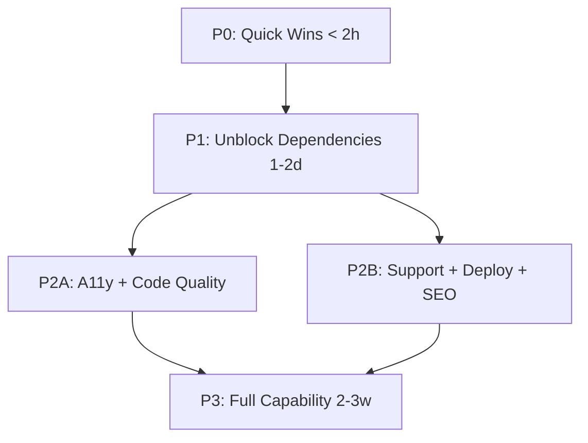

# DESIGNWISE SQUAD FIRE ORDER — SUMMIT DISPATCH
# Target: All 14 agents → 8.5+ (85% safeguard benchmark)
# Execution: Claude Code autonomous sessions
# Repo: zonewise-web (primary), cli-anything-biddeed (harnesses)



---

## STREAM TOPOLOGY — PARALLEL EXECUTION MAP

```yaml
streams:
  A_quality:
    agents: [CodeWise, QAWise]
    repo: zonewise-web
    files: [next.config.js, tsconfig.json, src/components/**, __tests__/**]
    depends_on: null
    
  B_seo_content:
    agents: [SEOWise, ContentWise]
    repo: zonewise-web
    files: [src/app/**/page.tsx metadata, src/components/Hero.tsx, public/sitemap.xml]
    depends_on: null
    
  C_a11y:
    agents: [A11yWise]
    repo: zonewise-web
    files: [src/app/layout.tsx, src/components/Explorer/**, src/components/SkipToContent.tsx]
    depends_on: null
    
  D_analytics:
    agents: [AnalyticsWise, IterateWise]
    repo: zonewise-web
    files: [src/lib/analytics.ts, src/app/layout.tsx providers, vercel.json]
    depends_on: null
    
  E_support:
    agents: [SupportWise]
    repo: zonewise-web
    files: [src/app/help/**, src/components/Onboarding/**, src/components/CrispWidget.tsx]
    depends_on: null
    
  F_infra:
    agents: [Commander, DeployWise, Sentinel V2]
    repo: zonewise-web + cli-anything-biddeed
    files: [.github/workflows/**, scripts/sentinel*]
    depends_on: null
    
  G_stitch:
    agents: [StitchWise, BrandGuard]
    repo: zonewise-web
    files: [src/components/generated/**, .stitch/**, skills/**]
    depends_on: [A_quality, C_a11y]
    toolchain: google-labs-code/stitch-skills (official Agent Skills)
```

---

## P0 — QUICK WINS (< 2 hours total)
### ⚡ PARALLEL — All independent, different files

### P0-1: A11yWise — Skip-to-content link (30m)
```
FILE: src/components/SkipToContent.tsx (NEW)
FILE: src/app/layout.tsx (ADD import + render)

Create:
- <a href="#main-content" className="sr-only focus:not-sr-only ...">Skip to content</a>
- Add id="main-content" to explorer/main content wrapper
- Style: absolute positioning, visible only on :focus
- Must be FIRST focusable element in DOM
```

### P0-2: A11yWise — Lighthouse audit baseline (30m)
```
COMMAND: npx lighthouse https://zonewise.ai --output=json --output=html --output-path=./lighthouse-report --chrome-flags="--headless --no-sandbox"
STORE: Upload scores to Supabase designwise_scores table
EXTRACT: accessibility score, performance score, SEO score, best-practices score
```

### P0-3: AnalyticsWise — Vercel Analytics (10m)
```
COMMAND: npm install @vercel/analytics
FILE: src/app/layout.tsx
ADD: import { Analytics } from '@vercel/analytics/react'
ADD: <Analytics /> inside root layout body
VERIFY: Build passes, component renders
```

### P0-4: SEOWise — GSC submission prep (20m)
```
VERIFY: public/sitemap.xml exists and is valid
VERIFY: public/robots.txt references sitemap URL
CREATE: src/app/robots.ts (Next.js metadata API) if not exists
CREATE: src/app/sitemap.ts (Next.js metadata API) if not exists
NOTE: Actual GSC submission = ARIEL HITL (needs Google account login)
```

---

## P1 — UNBLOCK DEPENDENCIES (1-2 days)
### 🔗 Mostly parallel, except IterateWise depends on AnalyticsWise

### P1-1: AnalyticsWise — PostHog installation (3h) [STREAM D]
```
COMMAND: npm install posthog-js
FILE: src/lib/posthog.ts (NEW)
  - Init PostHog with project API key
  - Export posthog instance
  - Wrap in typeof window check
  
FILE: src/components/PostHogProvider.tsx (NEW)
  - PostHogProvider wrapper component
  - Auto page view tracking
  - User identification on auth

FILE: src/app/layout.tsx
  - Wrap children in PostHogProvider

FILE: src/lib/analytics.ts (MODIFY)
  - Wire existing trackEvent() calls to posthog.capture()
  - Map event names to PostHog event schema
  - Keep Supabase logging as backup

VERIFY: PostHog dashboard shows page views within 5 min
NOTE: PostHog free tier = 1M events/mo — sufficient for beta
NOTE: API key needed — ARIEL HITL to create PostHog project OR Claude Code creates via API
```

### P1-2: AnalyticsWise — First funnel (3h) [STREAM D]
```
DEPENDS_ON: P1-1

PostHog funnel definition:
  Step 1: $pageview where pathname = "/" (landing)
  Step 2: $pageview where pathname contains "/explorer" (explorer)  
  Step 3: $pageview where pathname = "/pricing" (pricing)
  Step 4: signup_click event (CTA)

FILE: src/lib/analytics.ts
  - Add funnel step tracking at each transition point
  - Track: page_viewed, explorer_opened, pricing_viewed, signup_clicked, plan_selected

PostHog Dashboard:
  - Create "Core Funnel" dashboard
  - Add: funnel visualization, daily active users, top pages, session duration
```

### P1-3: CodeWise — Remove ignoreBuildErrors (9h) [STREAM A]
```
FILE: next.config.js (or next.config.ts)
  REMOVE: typescript: { ignoreBuildErrors: true }
  
THEN: npm run build
  - Capture ALL TypeScript errors
  - Categorize: type mismatch, missing types, any-casting, import errors
  - Fix in priority order: API routes → lib → components → pages
  
COMMON FIXES:
  - Add proper types to API response handlers
  - Replace `any` with specific interfaces
  - Add missing prop types to components
  - Fix incorrect import paths
  
FILE: .husky/pre-commit (NEW or MODIFY)
  - Add: npx tsc --noEmit
  - Prevents future TS regressions
  
VERIFY: npm run build succeeds with NO ignoreBuildErrors flag
VERIFY: tsc --noEmit returns 0 exit code
```

### P1-4: ContentWise — Fix 298 KPIs claim (2h) [STREAM B]
```
INVESTIGATE: What does "298 KPIs" actually reference?
  - Query Supabase for actual tracked metrics count
  - If real: link to source, show live count
  - If inflated: replace with honest number or remove

FILE: src/components/Hero.tsx (or wherever claim appears)
  OPTION A (if real): "298 tracked data points across 67 counties" + link to methodology
  OPTION B (if not real): Replace with live query: 
    "SELECT count(*) FROM parcel_data" → "{count} parcels analyzed"
  
FILE: src/components/StatsCounter.tsx (NEW)
  - Real-time counter pulling from Supabase
  - Displays: parcels analyzed, counties covered, queries processed
  - Updates via SWR/React Query with 5min cache
  
VERIFY: All claims on site are backed by queryable data
```

---

## P2A — CODE QUALITY + ACCESSIBILITY (1 week)
### 🔒 Sequential within stream, parallel across streams

### P2A-1: A11yWise — ARIA labels on map (6h) [STREAM C]
```
FILE: src/components/Explorer/MapCanvas.tsx
  ADD: role="application" to map container
  ADD: aria-label="Interactive zoning map of {county}"
  ADD: aria-live="polite" region for selection announcements
  
FILE: src/components/Explorer/ParcelTooltip.tsx
  ADD: role="tooltip"
  ADD: aria-describedby linking parcel data
  
FILE: src/components/Explorer/MapControls.tsx
  ADD: aria-label on zoom buttons, layer toggles
  ADD: keyboard event handlers (Enter/Space activation)
  
FILE: src/components/Explorer/RegionSelector.tsx
  ADD: role="listbox" + aria-selected on regions
  ADD: keyboard nav: arrow keys, Enter to select
```

### P2A-2: A11yWise — Contrast audit (3h) [STREAM C]
```
COMMAND: npx axe-core-cli https://zonewise.ai --tags wcag2aa
  - Or use Playwright + axe-core in test

FILE: src/app/globals.css
  - Fix any AA-failing color pairs
  - Ensure #64748b text on #020617 passes (check ratio ≥ 4.5:1)
  - Add focus-visible styles: outline: 2px solid #F59E0B, outline-offset: 2px
  
VERIFY: axe-core returns 0 violations
VERIFY: All interactive elements have visible focus indicator
```

### P2A-3: A11yWise — Keyboard navigation for map (4h) [STREAM C]
```
FILE: src/components/Explorer/MapCanvas.tsx
  - Add tabIndex={0} to map container
  - Arrow keys pan map
  - +/- keys zoom
  - Tab cycles through visible parcels
  - Enter selects focused parcel
  - Escape deselects
  
FILE: src/hooks/useMapKeyboard.ts (NEW)
  - Custom hook encapsulating all keyboard handlers
  - Mapbox GL JS keyboard integration
```

### P2A-4: CodeWise — Unit tests for top components (6h) [STREAM A]
```
SETUP: 
  npm install -D vitest @testing-library/react @testing-library/jest-dom jsdom

FILE: vitest.config.ts (NEW)
  - Setup with jsdom environment
  - Coverage thresholds: 50% statements

TESTS (priority order):
  1. src/components/Explorer/MapCanvas.test.tsx — renders, loads Mapbox
  2. src/components/Explorer/ChatInput.test.tsx — input, submit, clear
  3. src/components/Explorer/ParcelPanel.test.tsx — display parcel data
  4. src/components/Pricing/PricingCards.test.tsx — tiers render, CTAs work
  5. src/components/Hero.test.tsx — stats counter, CTA links
  6. src/app/api/chat/route.test.ts — streaming response, error handling

FILE: .github/workflows/ci.yml (MODIFY)
  ADD: vitest run --coverage step
  ADD: fail if coverage < 50%
```

### P2A-5: CodeWise — Pre-commit hook (1h) [STREAM A]
```
COMMAND: npx husky install
FILE: .husky/pre-commit
  #!/bin/sh
  npx tsc --noEmit
  npx vitest run --reporter=verbose

VERIFY: Commit with TS error is rejected
VERIFY: Commit with failing test is rejected
```

---

## P2B — SUPPORT + DEPLOY + SEO (1 week, parallel with P2A)

### P2B-1: SupportWise — FAQ page (3h) [STREAM E]
```
FILE: src/app/help/page.tsx (NEW)
  - 10 FAQ items in accordion component
  - Categories: Getting Started, Explorer, Pricing, Data, API
  - Search/filter functionality
  - Styled with house brand (navy/orange/dark)
  
FAQ CONTENT:
  1. What is ZoneWise.AI?
  2. How do I use the explorer?
  3. What data sources do you use?
  4. Which counties are covered?
  5. What's the difference between Free and Pro?
  6. How accurate is the zoning data?
  7. Can I export data?
  8. How does the AI chat work?
  9. How do I contact support?
  10. Is my data secure?

ADD: Link to /help in footer navigation
ADD: Link to /help in user dropdown menu
```

### P2B-2: SupportWise — Onboarding tour (4h) [STREAM E]
```
COMMAND: npm install @reactour/tour
FILE: src/components/Onboarding/OnboardingTour.tsx (NEW)
  
STEPS:
  1. Welcome → "Welcome to ZoneWise.AI! Let's explore Florida's zoning data."
  2. Map → "This is the explorer. Click any county to dive in."
  3. Chat → "Ask questions in natural language. Try: 'Show me residential zones in Duval County'"
  4. Layers → "Toggle map layers to see different data views."
  5. Pricing → "Upgrade to Pro for full access to all 67 counties."

TRIGGER: First visit (check localStorage flag or Clerk metadata)
FILE: src/app/layout.tsx — wrap in TourProvider
VERIFY: Tour displays on first visit, dismissible, doesn't show again
```

### P2B-3: SupportWise — Crisp chat widget (1h) [STREAM E]
```
COMMAND: npm install crisp-sdk-web
FILE: src/components/CrispWidget.tsx (NEW)
  - Initialize Crisp with website ID
  - Load only on client side
  - Auto-identify user via Clerk auth data

FILE: src/app/layout.tsx — add CrispWidget
NOTE: Crisp account creation = ARIEL HITL (or Claude Code via API)
NOTE: Free tier = 2 seats, unlimited conversations
```

### P2B-4: DeployWise — Health check + rollback (5h) [STREAM F]
```
FILE: .github/workflows/deploy-prod.yml (MODIFY)
  
ADD STEP: post-deploy health check
  - curl -sf https://zonewise.ai/api/health || exit 1
  - curl -sf https://zonewise.ai || exit 1
  - Check response time < 3s
  
ADD STEP: rollback on failure
  - Store previous deployment URL before deploy
  - If health check fails: vercel alias set {previous-url} zonewise.ai
  - Send Telegram alert: "🚨 Deploy failed, rolled back to {previous}"

FILE: src/app/api/health/route.ts (NEW)
  - Returns { status: "ok", version: process.env.COMMIT_SHA, timestamp }
  - Checks: Supabase connection, env vars present
  - Returns 503 if any check fails
```

### P2B-5: SEOWise — Per-route meta descriptions (4h) [STREAM B]
```
FILES: Every page.tsx in src/app/
  
METADATA (Next.js Metadata API):
  /           → "AI-powered zoning intelligence for Florida real estate. Explore 67 counties, 262K+ parcels."
  /explorer   → "Interactive zoning map explorer. Click any Florida county for instant zoning data."
  /pricing    → "ZoneWise.AI pricing. Free explorer access. Pro plans from $39/month."
  /about      → "Built by Everest Capital USA. AI meets 10+ years of Florida real estate expertise."
  /help       → "ZoneWise.AI help center. FAQs, guides, and support for zoning intelligence."
  + dynamic routes for /explorer/[county]

FILE: src/components/BreadcrumbJsonLd.tsx (NEW)
  - BreadcrumbList JSON-LD for explorer drill-down
  - Home > Explorer > County > Parcel
  
VERIFY: Each page has unique <title> and <meta name="description">
VERIFY: JSON-LD validates at schema.org validator
```

### P2B-6: SEOWise — Lighthouse SEO audit (2h) [STREAM B]
```
Run Lighthouse on all 8 routes
Fix all SEO-flagged issues
Target: SEO score ≥ 95 on all pages
Store results in Supabase for tracking
```

---

## P2C — INFRASTRUCTURE (parallel with P2A/P2B)

### P2C-1: Commander — OAuth health check (2h) [STREAM F]
```
FILE: scripts/oauth-health-check.sh (NEW)
  - Decode CLAUDE_OAUTH_B64
  - Check token expiry timestamp
  - If < 7 days remaining: Telegram warning
  - If expired: Telegram critical alert + block SUMMIT dispatch

FILE: .github/workflows/sentinel.yml (MODIFY)
  - Add oauth-health-check step before any SUMMIT dispatch
  - Run daily at 6AM EST
```

### P2C-2: Commander — Token auto-refresh (3h) [STREAM F]
```
FILE: scripts/oauth-refresh.sh (NEW)
  - Attempt token refresh using refresh_token
  - Update CLAUDE_OAUTH_B64 GitHub secret via gh CLI
  - Log to Supabase sentinel_runs
  - Telegram confirmation on refresh
  
NOTE: If OAuth doesn't support refresh, document manual process + 30-day Telegram reminder
```

### P2C-3: Sentinel V2 — Stale workflow filter (1h) [STREAM F]
```
FILE: scripts/sentinel-patrol.sh (MODIFY)
  - Add STALE_WORKFLOW_FILTER array with known 422-producing workflow names
  - Skip alerting on filtered workflows
  - Log filtered events separately (don't suppress from Supabase, just from Telegram)
```

### P2C-4: Sentinel V2 — Weekly health summary (2h) [STREAM F]
```
FILE: .github/workflows/sentinel-weekly.yml (NEW)
  - Cron: Sunday 9AM EST
  - Query sentinel_runs for last 7 days
  - Aggregate: patterns triggered, fixes applied, false positives
  - Format markdown summary
  - Send to Telegram
```

---

## P3 — FULL CAPABILITY (2-3 weeks, after P2 complete)
### P3-1: StitchWise — Official Stitch Skills Integration (10h) [STREAM G]
```
DEPENDS_ON: P2A complete (TypeScript clean, tests passing)
SOURCE: https://github.com/google-labs-code/stitch-skills (Apache-2.0)

STEP 0: Install official Stitch Agent Skills (replaces custom 840 LOC harness)
  npx skills add google-labs-code/stitch-skills --skill stitch-design --global
  npx skills add google-labs-code/stitch-skills --skill react:components --global
  npx skills add google-labs-code/stitch-skills --skill design-md --global
  npx skills add google-labs-code/stitch-skills --skill enhance-prompt --global
  npx skills add google-labs-code/stitch-skills --skill shadcn-ui --global

STEP 1: Generate .stitch/DESIGN.md from ZoneWise brand tokens
  - Use design-md skill to analyze existing components
  - Map house brand (Navy #1E3A5F, Orange #F59E0B, Dark #020617, Inter font)
  - Output: .stitch/DESIGN.md as design system source of truth

STEP 2: Run stitch-design skill on 3 ZoneWise screens
  - Targets: Explorer map panel, Pricing cards, Help FAQ accordion
  - enhance-prompt preprocesses vague descriptions into Stitch-optimized prompts
  - stitch-design generates high-fidelity HTML screens via Stitch MCP

STEP 3: Convert to React via react:components skill
  - Pipeline: Stitch HTML → retrieval via curl → token mapping via style-guide.json → AST validation
  - Output: src/components/generated/ with validated React components
  - Built-in AST validation catches syntax errors before commit

STEP 4: Compare generated vs hand-coded components
  - Side-by-side visual diff
  - Lighthouse score comparison (perf, a11y)
  - If generated ≥ 90% quality: ship to production
  - If not: document gaps, file upstream issue

STEP 5: Ship 1 generated component to production
  - Merge best candidate into src/components/
  - Add Vitest snapshot test
  - Verify npm run build passes

STEP 6: Wire stitch_usage quota tracking to Supabase
  - Track: generations used / 350 free monthly
  - Alert at 80% usage via Telegram

STEP 7: Deprecate custom 840 LOC StitchWise harness
  - Archive to src/legacy/stitchwise-v1/
  - Update CLAUDE.md to reference official skills
  - Remove @google/stitch-sdk and @_davideast references from SPEC-PATCH.md

NOTE: Official skills follow Agent Skills open standard — compatible with
Claude Code, Gemini CLI, Cursor, Antigravity. Structure per skill:
  SKILL.md (mission control) + scripts/ (validation) + resources/ (style guides) + examples/ (gold standard)
```
```

### P3-2: IterateWise — First A/B test (depends on P1-1, P1-2)
```
DEPENDS_ON: AnalyticsWise ≥ 7.0 (PostHog live, funnel tracking)

1. Create PostHog Feature Flag: hero_cta_variant
2. Variant A (control): current CTA text
3. Variant B: alternate CTA text
4. Measure: click-through rate over 2 weeks
5. Document result in ab_tests Supabase table
6. Ship winner permanently
```

### P3-3: ContentWise — Social proof (11h)
```
1. Add live usage counter component (parcels analyzed, from Supabase)
2. Collect 3 beta testimonials (ARIEL HITL — needs user outreach)
3. Build testimonial carousel component
4. Create 1 case study page: county analysis walkthrough
5. Add to homepage below hero
```

### P3-4: SupportWise — API docs (6h)
```
FILE: src/app/docs/page.tsx (NEW)
  - API reference for Pro users
  - Endpoint documentation
  - Code examples (curl, Python, JS)
  - Rate limits and authentication
  - Styled with house brand
```

### P3-5: QAWise — Extended E2E (5h)
```
FILE: tests/e2e/chat-streaming.spec.ts (NEW)
  - Send query to chat
  - Verify SSE stream initiates
  - Verify response renders incrementally
  - Verify map updates after relevant query

FILE: tests/e2e/mobile.spec.ts (NEW)
  - Run full suite at 375px (iPhone SE)
  - Run full suite at 768px (iPad)
  - Verify no horizontal overflow
  - Verify touch interactions on map
```

---

## ARIEL HITL — CANNOT AUTOMATE (< 5 min total)

```yaml
hitl_tasks:
  - task: "Submit sitemap to Google Search Console"
    url: "https://search.google.com/search-console"
    time: "2 min"
    when: "After P0-4 verifies sitemap"
    
  - task: "Create PostHog project (if not via API)"
    url: "https://app.posthog.com/signup"
    time: "3 min"
    when: "Before P1-1"
    provides: "PostHog project API key"
    
  - task: "Create Crisp account"
    url: "https://app.crisp.chat/initiate/signup"
    time: "2 min"  
    when: "Before P2B-3"
    provides: "Crisp website ID"
    
  - task: "Reach out to 3 beta users for testimonials"
    time: "10 min"
    when: "Before P3-3"
```

---

## SCORE PROJECTIONS AFTER EACH PHASE

```yaml
after_P0:
  AnalyticsWise: 2.5 → 3.5  # Vercel Analytics live
  A11yWise: 5.0 → 5.5       # skip-to-content + baseline score
  SEOWise: 6.5 → 7.0        # sitemap validated

after_P1:
  AnalyticsWise: 3.5 → 7.0  # PostHog + funnel live
  CodeWise: 6.5 → 8.0       # TS clean, no ignoreBuildErrors
  ContentWise: 7.5 → 8.5    # claims substantiated

after_P2:
  A11yWise: 5.5 → 8.5       # ARIA + contrast + keyboard
  CodeWise: 8.0 → 9.0       # tests + pre-commit
  SupportWise: 2.0 → 7.5    # FAQ + tour + widget
  DeployWise: 8.0 → 9.0     # health check + rollback
  SEOWise: 7.0 → 8.5        # meta + breadcrumbs + audit
  Commander: 8.5 → 9.0      # OAuth health + refresh
  Sentinel: 8.5 → 9.0       # filter + weekly summary

after_P3:
  StitchWise: 4.5 → 8.5     # official google-labs-code/stitch-skills integrated
  IterateWise: 1.5 → 7.0    # first A/B complete
  ContentWise: 8.5 → 9.0    # social proof live
  SupportWise: 7.5 → 8.5    # API docs added
  QAWise: 8.5 → 9.0         # streaming + mobile tests
  AnalyticsWise: 7.0 → 8.5  # A/B measurement pipeline

final_composite: 8.5+ across all scoreable agents
```
